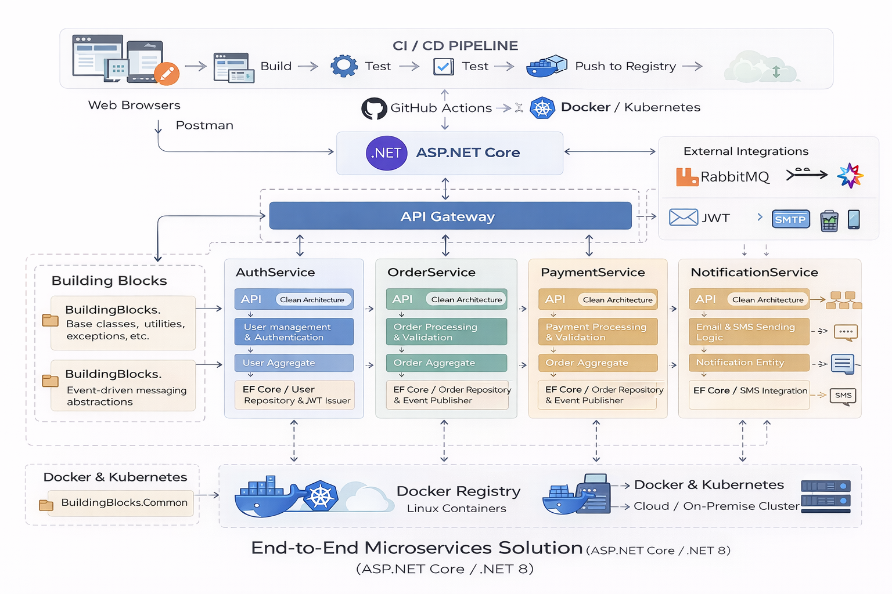

# DotNet Microservices Demo (ASP.NET Core / .NET 8)

  

This repository contains a **manually created microservices demo** built using **ASP.NET Core (.NET 8)**.

The intent of this project is **purely demonstration and learning**.  
It is not a finished product or a boilerplate template. Instead, it shows **how I approach microservice design from scratch**, focusing on structure, boundaries, and long-term maintainability.

Every folder, project, and reference has been added deliberately to reflect patterns that are commonly used in real production systems.

---

## Why This Repository Exists

When working with microservices, the most critical part is **architecture and boundaries**, not just writing controllers or APIs.

This demo focuses on:

- Clear **service boundaries**
- Proper **Clean Architecture layering**
- Avoiding tight coupling between services
- Using modern **ASP.NET Core (.NET 8)** practices
- Keeping the design **simple, readable, and realistic**

The goal is that anyone opening this repository can understand the overall design within a few minutes.

---

## High-Level Architecture Overview

At a high level, the system follows a **Gateway + Microservices** approach.

Client (Browser / Postman)
|
v
ApiGateway
|
+----------------------+
| |
AuthService Other Services

Key architectural points:

- All external traffic enters through the **API Gateway**
- Each microservice owns its own logic and data
- No service depends on another service’s internal implementation
- Shared logic is kept minimal and placed in dedicated building blocks

---

## Technology Choices

This demo intentionally uses **modern and actively used technologies** only:

- **.NET 8 (LTS)**
- **ASP.NET Core Web API**
- **Clean Architecture**
- **Swagger / OpenAPI**
- **Entity Framework Core** (planned)
- **JWT Authentication** (planned)
- **Event-driven communication (RabbitMQ)** (planned)
- **Docker & Docker Compose** (planned)

No legacy **.NET Framework** is used anywhere in this solution.

---

## Solution Structure

The project is intentionally kept as **a single Visual Studio solution** to make it easy to explore and review.

dotnet-microservices-demo
│
├── building-blocks
│ ├── BuildingBlocks.Common
│ └── BuildingBlocks.EventBus
│
├── gateway
│ └── ApiGateway
│
├── services
│ └── AuthService
│ ├── AuthService.API
│ ├── AuthService.Application
│ ├── AuthService.Domain
│ └── AuthService.Infrastructure
│
└── DotNetMicroservicesDemo.sln

Each folder and project has a clearly defined responsibility.

---

## Building Blocks

### BuildingBlocks.Common

This project contains **shared utilities and base abstractions** that can be reused across services.

Typical examples:
- Base entity classes
- Common result or error models
- Cross-cutting helper utilities

This project does **not** contain business logic.

---

### BuildingBlocks.EventBus

This project is intended to hold **event-driven communication abstractions**.

Examples include:
- Event interfaces
- Event handler contracts
- Messaging abstractions

Concrete implementations (for example, RabbitMQ) will be added later inside infrastructure layers.

---

## API Gateway

`ApiGateway` is an **ASP.NET Core Web API** project.

Its responsibilities are intentionally limited:

- Acts as the single entry point to the system
- Routes requests to backend services
- Hosts cross-cutting concerns

At this stage, the gateway is kept minimal on purpose.  
More advanced routing and validation logic will be added incrementally.

---

## AuthService (First Microservice)

`AuthService` is the first microservice created in this demo and acts as a **reference template** for additional services.

It follows **Clean Architecture** and is split into four projects.

---

### AuthService.API

- Handles HTTP requests and responses
- Contains controllers and endpoints
- Very thin layer
- Depends on Application and Infrastructure layers

---

### AuthService.Application

- Contains application-level logic
- Orchestrates use cases
- Defines interfaces required by infrastructure

This layer does not know how data is stored or how external systems are implemented.

---

### AuthService.Domain

- Contains core business entities
- Holds domain rules and invariants
- Has **no dependencies** on any other project

This is the most stable and independent part of the service.

---

### AuthService.Infrastructure

- Implements data access
- Will contain EF Core DbContext
- Will contain messaging and external integrations

This layer depends on Application and Domain, never the other way around.

---

## Clean Architecture Dependency Rule

The dependency direction is strictly enforced:

API
↓
Application
↓
Domain
↑
Infrastructure

This ensures:
- Business logic remains independent
- Infrastructure can be replaced or modified easily
- Code stays testable and maintainable

---

## Current State of the Project

At the current stage, this repository contains:

- ✔ Clean solution and folder structure
- ✔ API Gateway project
- ✔ AuthService scaffolded with proper layering
- ✔ Shared building blocks
- ✔ Correct and verified project references

What is intentionally **not implemented yet**:

- Authentication logic
- Database integration
- Event-driven communication
- Docker configuration

These will be added step by step.

---

## Running the Project (Current)

At this stage, services can be run individually from Visual Studio.

Example:
1. Set `ApiGateway` or `AuthService.API` as the startup project
2. Run using `F5`
3. Open the `/health` endpoint to verify the service is running

---

## Planned Next Steps

- Implement AuthService (JWT authentication + EF Core)
- Add OrderService, PaymentService, NotificationService
- Introduce event-driven communication
- Add Docker and Docker Compose
- Add CI workflow

---

## Author

**Jagdish Singh**  
Senior .NET Developer / Tech Lead  

This repository reflects how I typically design and evolve microservices in real-world systems.